# LiLIS: Reproducing a Distributed Learned Spatial Index on Apache Spark

Final-term project for **Dữ liệu lớn & Cơ sở dữ liệu phân tán** (IS405.Q22 & IS211.Q23), University of Information Technology, VNU-HCM — Group 6, 2026.

This project reproduces and experimentally evaluates **LiLIS** (arXiv:[2504.18883](https://arxiv.org/abs/2504.18883)), a lightweight distributed learned spatial index built on Apache Spark, proposed by the [SWUFE-DB-Group](https://swufe-db-group.github.io/learned-index-spark/). We deployed it on a **real 3-node Apache Spark Standalone cluster** (20 CPU cores over physical LAN, not simulated) and benchmarked it against traditional spatial indexing (Apache Sedona: R-tree, Quad-tree, KD-tree) on up to **100 million points**.

> This is a course reproduction of prior published research, not a novel system. The LiLIS algorithm design and the base Java implementation (partitioning strategies, learned-index build) originate from the paper authors' repository; our contribution was porting it to our own cluster and dependency versions, debugging real compatibility breaks, collecting and cleaning our own datasets, and running/analyzing a full benchmark suite. See [Team & contribution](#team--contribution) below for exactly who did what.

## Results summary

Measured on our own 3-node LAN cluster (not simulated), against 46.5M real NYC Yellow Taxi points:

| Query | LiLIS-K (learned index) | Sedona-N (no index, brute force) | Speedup |
|---|---:|---:|---:|
| Point Query | 780 ms | 7,032 ms | 9.0× |
| Range Query | 743 ms | 7,528 ms | 10.1× |
| kNN (k=10) | 566 ms | 5,643 ms | 10.0× |

Index build time: LiLIS-K built its index **1.6–2.5× faster** than the fastest Sedona baseline across all three datasets (CHI 7.7M / NYC 46.5M / SYN 100M rows). Full per-variant numbers are in [`lilis/results/`](lilis/results/) and [`sedona-baseline/results/`](sedona-baseline/results/).

We reproduced 3 of the paper's 5 core takeaways on our (smaller-scale, real-hardware) setup and found one extension the paper doesn't mention: on the CHI dataset, Adaptive-grid partitioning becomes competitive with KD-tree, unlike on NYC.

### Full benchmark charts

Generated by [`lilis/scripts/visualize_summary.py`](lilis/scripts/visualize_summary.py) and [`visualize_rq2.py`](lilis/scripts/visualize_rq2.py)–[`visualize_rq5.py`](lilis/scripts/visualize_rq5.py) from the raw run logs in [`lilis/results/`](lilis/results/) and [`sedona-baseline/results/`](sedona-baseline/results/), full-size copies in [`docs/figures/`](docs/figures/):

| | |
|---|---|
| 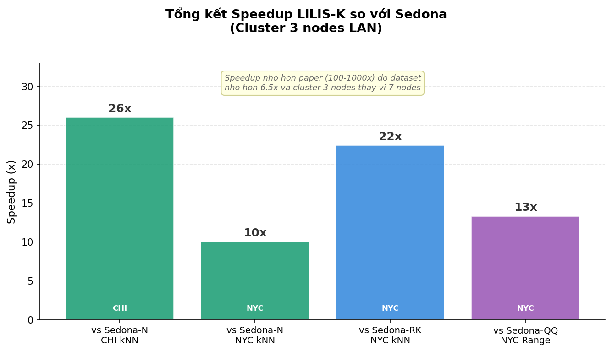 | 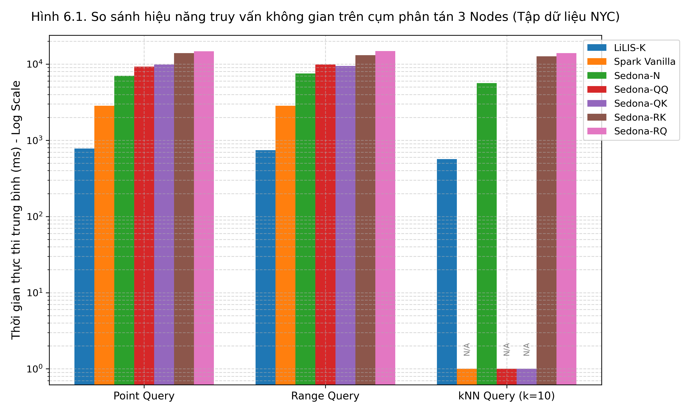 |
| Reproduction status of the paper's 5 core takeaways | Query latency across all 5 partitioning variants (NYC) |
| 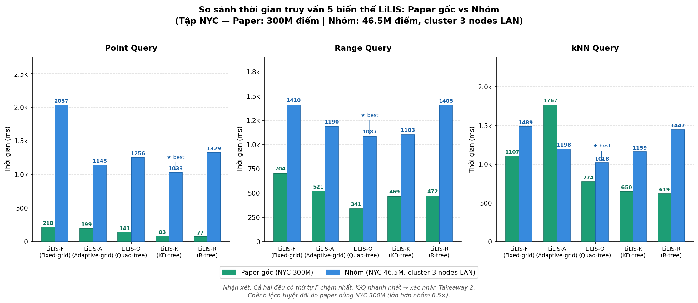 | 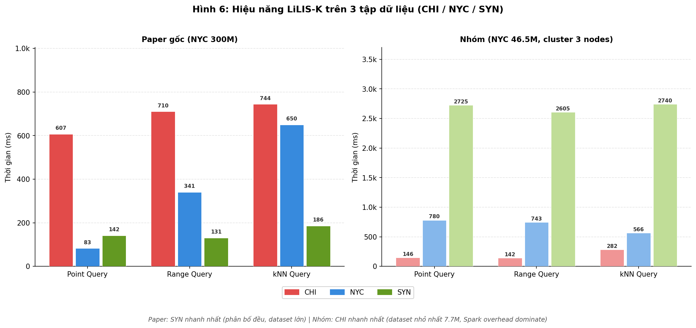 |
| RQ2 — partitioning strategy sensitivity (Takeaway 2) | RQ3 — kNN query stability as *k* increases (1→100) |
| 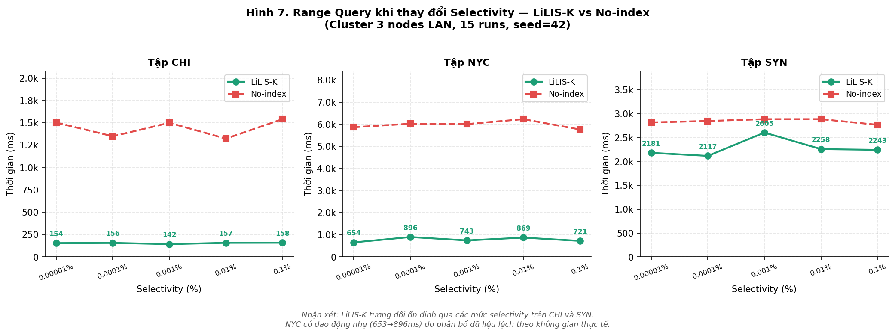 | 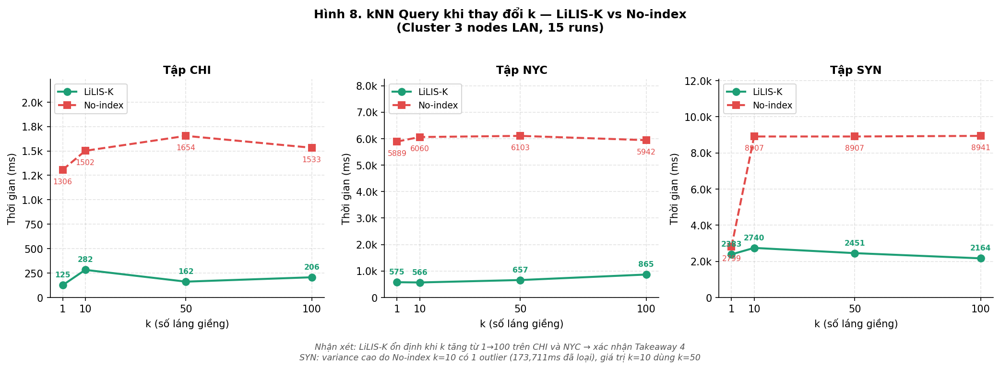 |
| RQ4 — Range Query latency vs. selectivity | RQ4 — kNN latency vs. *k* |
| 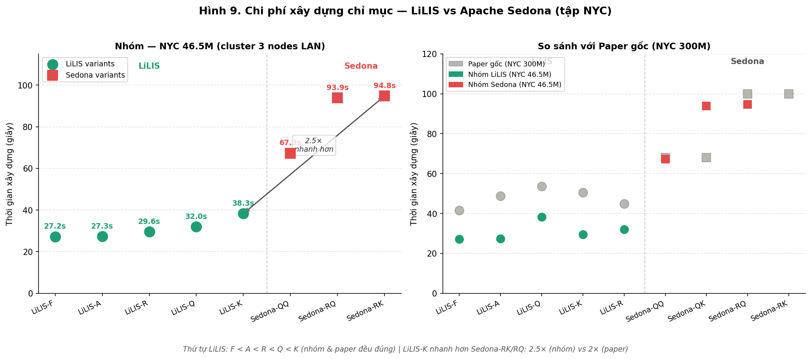 | 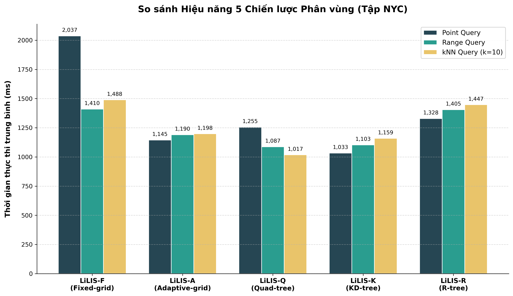 |
| RQ5 — index build-cost comparison across variants | Full per-variant results table |

## Architecture

```
3-node Apache Spark Standalone cluster (LAN, WSL2/Ubuntu 22.04, Java 11, Spark 3.5.8)
 ├─ Master/Driver  — 4 cores / 4 GB
 ├─ Worker 1       — 8 cores / 8 GB
 └─ Worker 2       — 8 cores / 8 GB

Global partitioning (5 variants) → local learned index (Taut-String PLR spline, Y-sorted)
 Fixed-grid | Adaptive-grid | Quad-tree | KD-tree | R-tree
```

Getting all 3 machines to see each other over the physical LAN required switching WSL2 from NAT to **Mirrored Networking mode** (`.wslconfig`) — by default each WSL2 instance sits behind its own Hyper-V NAT and is unreachable from other machines on the network.

## Data pipeline

Three datasets go through one shared cleaning/normalization pipeline (`pandas` + `numpy`) before anything touches Spark:

| Dataset | Description | Valid points | Bounding box |
|---|---:|---:|---|
| NYC | NYC Yellow Taxi (pickup coordinates) | 46,475,157 | X ∈ [-74.99, -72.20], Y ∈ [40.01, 41.92] |
| CHI | Chicago Crimes | 7,699,698 | X ∈ [-91.69, -87.52], Y ∈ [36.62, 42.02] |
| SYN | Synthetic uniform (stress test) | 100,000,000 | X, Y ∈ [0, 1] |

1. **Collection & merge (NYC)** — 4 raw `yellow_*.csv` files (~7.9 GB combined) discovered with `glob.glob()`, each read in **200,000-row chunks** via pandas' chunked `read_csv` and concatenated with `pd.concat()`, instead of loading the full merge into memory at once.
2. **Null handling** — rows with a null `Latitude`/`Longitude` are dropped (`dropna()`). Root cause differs by dataset: missing GPS reception at event time for CHI, vs. the taxi terminal failing to transmit a pickup coordinate for NYC.
3. **GPS `(0,0)` filtering (NYC-specific)** — after `dropna()`, a systematic-error pattern unique to taxi data remained: rows defaulting to `(0.0, 0.0)` when the GPS unit had no signal. This doesn't occur in CHI, so it's handled as an NYC-only step.
4. **Geographic bounding-box filtering** — a final pass keeps only points inside each city's real administrative bounding box (table above); everything else is treated as bad input (mis-keyed coordinates, GPS error, or a mis-geotagged event).
5. **Net effect on NYC**: 47,248,845 raw rows → **46,475,157 valid points**, 773,688 dropped (~1.6%) — see [`nyc_valid_invalid_records.png`](lilis/results/figures/nyc_valid_invalid_records.png) below.
6. **Min-Max normalization to `[0,1] × [0,1]`** — not cosmetic: LiLIS encodes each 2D coordinate into a 1D sort key, and that encoding scheme requires both axes to already live in `[0,1]` before the sort key can be computed.

### Exploratory analysis / visualization

Spatial skew was profiled *before* picking a partitioning strategy — this is what actually motivates having 5 different partitioners rather than one:

- 2D density heatmaps (linear-scale + log-scale) per dataset: CHI is fairly evenly spread across the city with a mild downtown hot-spot; NYC is heavily clustered around Manhattan — a textbook skewed-urban-data shape.
- 20×20 grid-density analysis (400 cells): quantifies that skew — CHI's cell counts stay comparatively even, NYC's vary by orders of magnitude between Manhattan cells and outer-borough cells. That measured skew is a direct input into why grid-based partitioning (Fixed-grid) underperforms tree-based partitioning (KD-tree, Quad-tree) specifically on NYC — see [Results summary](#results-summary).
- A supplementary 3×2 statistical layout per axis: violin plot (distribution shape + outliers), ECDF, and scatter + marginal histogram / hexbin at higher resolution.

Pipeline output actually checked into this repo ([`lilis/results/figures/`](lilis/results/figures/)):

| | |
|---|---|
| 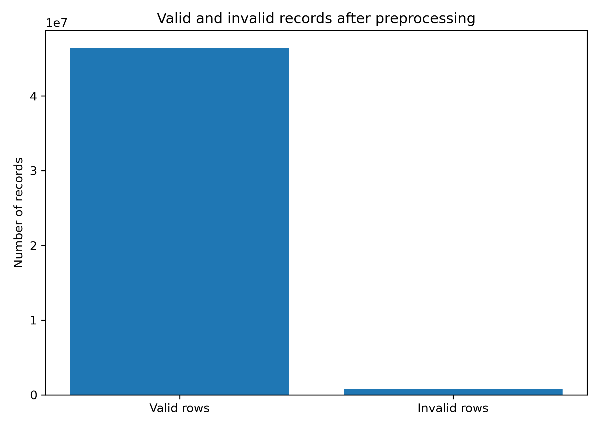 | 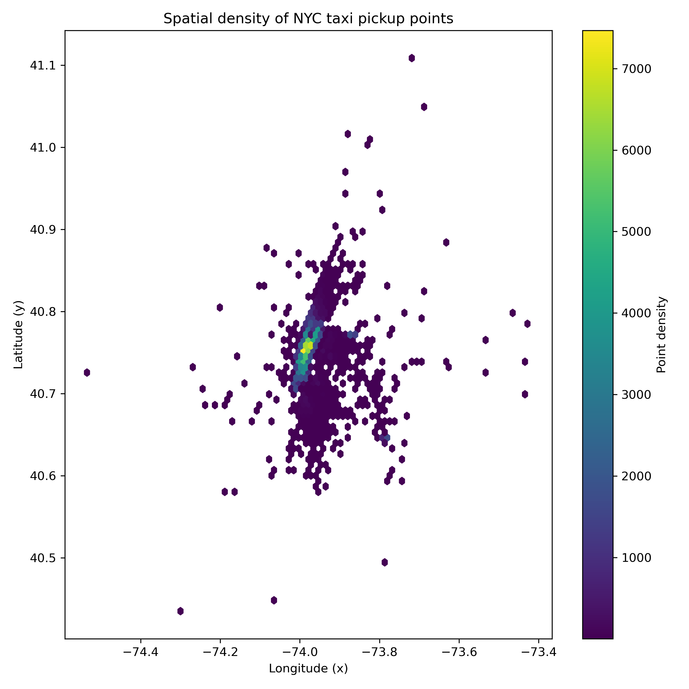 |
| Valid vs. dropped rows after cleaning (46.48M valid / 0.77M dropped) | Hexbin spatial density of NYC pickups — Manhattan clustering clearly visible |
| 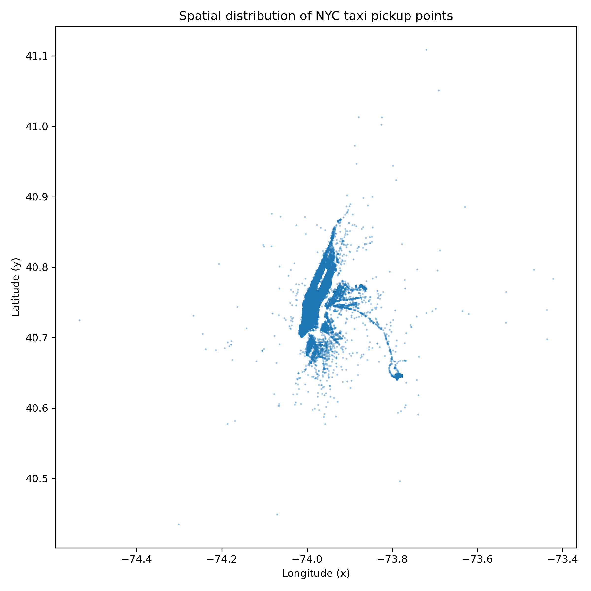 | 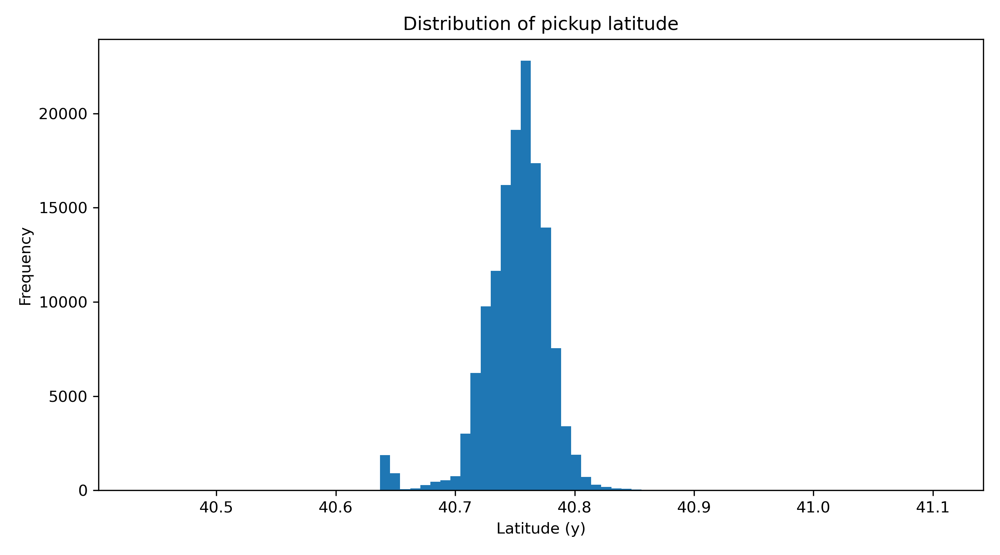 |
| Scatter sample of cleaned pickup coordinates | Latitude distribution after cleaning (see also [`nyc_longitude_distribution.png`](lilis/results/figures/nyc_longitude_distribution.png)) |

Raw post-cleaning coordinate stats ([`nyc_xy_stats.txt`](lilis/results/figures/nyc_xy_stats.txt)): x ∈ [-74.9996, -72.1965] (mean -73.974), y ∈ [40.0081, 41.9237] (mean 40.751) — consistent with the NYC bounding box above.

## Technical highlights worth knowing before you ask about this in an interview

- **Dependency pinning was not arbitrary.** `sedona-core` is pinned at `1.2.0-incubating` because that is the exact version whose API (`KDBTree`, `HalfOpenRectangle`, `QuadTreePartitioner`) the original authors' code targets — upgrading to 1.6.x breaks the API surface entirely. See the comments in [`lilis/pom.xml`](lilis/pom.xml).
- **Real compatibility break, fixed in code**: [`KDBTreePartitioner.java`](lilis/src/main/java/partitions/KDBTreePartitioner.java) documents fixing a class-rename between Sedona versions (`KDBTree` → `KDB`) that the original repo's code didn't account for.
- **Spark vs. bundled-dependency conflict**: an early build threw `ClassNotFoundException: org.locationtech.jts.geom.Envelope` because Spark's own JARs were being bundled and conflicting with the real runtime classpath — fixed by marking `spark-core`/`spark-sql` as `provided` scope while bundling `sedona-core` and `jts-core` into the fat JAR.
- **`AdaptiveGridPartitioner`** is fully custom (not calling into Sedona's built-in classes, unlike the KD-tree/Quad-tree/R-tree variants) — implements a custom Spark `Partitioner` and computes its grid step via a manual `aggregate()` combine/seq-op pass over the RDD.
- **`KDBTreePartitioner`** samples 1% of the data (paper spec) to estimate the spatial boundary before building the real KD-tree, then performs the actual physical shuffle via `flatMapToPair(...).partitionBy(...)`.
- Query execution ([`PointQuery.java`](lilis/src/main/java/query/PointQuery.java), [`RangeQuery.java`](lilis/src/main/java/query/RangeQuery.java)) is a two-stage filter: coarse-filter partitions by their bounding box (from local spline metadata) first, then fine-scan only the surviving partitions with `mapPartitions` — this is the actual mechanism behind the index's speedup over full scan.

## Team & contribution

2-person team. Per the project's own work-division table (also in the full academic report):

| Area | Nguyễn Nhật Minh | Nguyễn Văn Lê Hùng |
|---|---|---|
| Theory research | Spark/RDD architecture, shuffle mechanics; KD-tree/Quad-tree partitioning analysis | Learned-index theory (Spline/PLR); Space-filling curves (Z-order, Y-sort) |
| Data | Collected & merged NYC Yellow Taxi (4 CSVs); spatial distribution visualization | Collected/cleaned CHI (Chicago Crimes) and SYN (synthetic); Min-Max normalization |
| Infra | Master server + LAN config; fixed WSL2/Hyper-V NAT routing (Mirrored Networking) | Worker/executor setup; Apache Sedona baseline install & config |
| Implementation | Ported/debugged `SpatialPartition` (5 global-partitioning variants); Point/Range query benchmark scripts | Ported/debugged the Spline learned-index build; implemented kNN query (expanding-radius search) |
| Experiments | Ran LiLIS + Spark-Vanilla experiments; kNN/Range Query analysis vs. paper | Ran Sedona baseline experiments; index-build-cost analysis |
| Report | Chapters I, II, IV; presentation script & slides | Chapters III, V, VI; document formatting & data QA |

## Repository structure

```
lilis/               — LiLIS implementation (this repo's main code)
  src/main/java/      — partitioners, learned index, query engine
  src/test/java/      — parity tests (point/range/kNN query, spline build)
  scripts/            — benchmark shell scripts + Python result visualizers
  results/            — benchmark output (build times, query latency, correctness checks)
  results/figures/    — data-pipeline / EDA output (cleaning stats, density plots)
sedona-baseline/      — Apache Sedona baseline used for comparison
  src/main/java/baseline/
  results/
docs/figures/         — full-size benchmark result charts (RQ2–RQ5, takeaway summary)
```

## Running it

Prerequisites: Java 11, Apache Spark 3.5.x (Standalone or local), Maven.

```bash
cd lilis
mvn clean package
# builds target/LearnIndexSpark-1.0-SNAPSHOT-jar-with-dependencies.jar
# entry point: idnexbuild.BuildAll

cd ../sedona-baseline
mvn clean package
# entry point: baseline.SedonaNBaseline
```

See [`lilis/scripts/run_benchmark.sh`](lilis/scripts/run_benchmark.sh) and [`run_query_benchmark.sh`](lilis/scripts/run_query_benchmark.sh) for the exact benchmark invocations used to produce the results in `results/` (15 runs/query, 2 warm-up runs, seed=42).

Note: this repo does not include the raw datasets (NYC Yellow Taxi ~7.9GB, CHI Crimes ~1.9GB) or the large per-run cluster logs — only the processed benchmark output. Datasets: [NYC Yellow Taxi (Kaggle)](https://www.kaggle.com/datasets/elemento/nyc-yellow-taxi-trip-data), [Chicago Crimes](https://data.cityofchicago.org).

## Acknowledgment

Based on the LiLIS paper and reference implementation by the SWUFE-DB-Group: [swufe-db-group.github.io/learned-index-spark](https://swufe-db-group.github.io/learned-index-spark/) ([arXiv:2504.18883](https://arxiv.org/abs/2504.18883)).

## License

MIT — matching the original repository's license.
